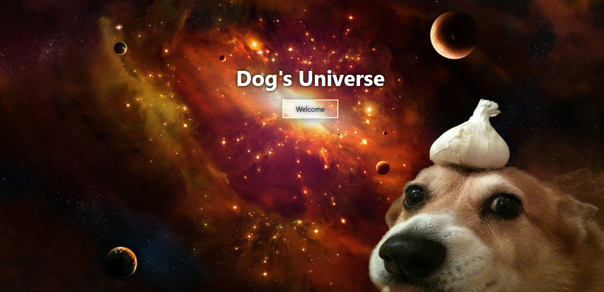
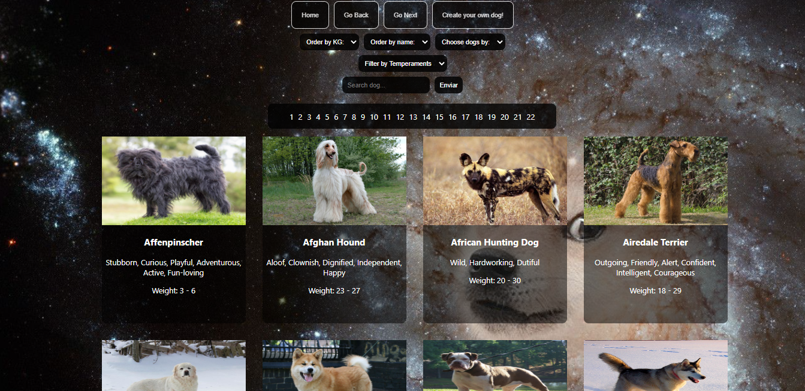
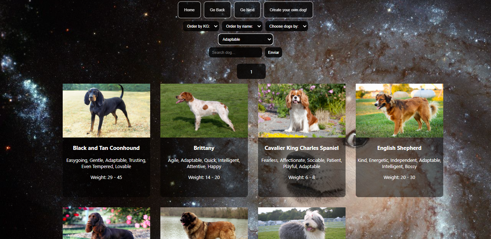
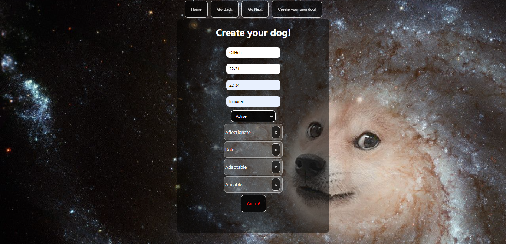

Sorry for the bad practices! I was just a beginning student in that time!

## Starting

 1. Fork the repository to have a copy of it in your account.
 2. Clone the repository on your computer to start working.

You will have `boilerplate` with the general structure of both server and client.

__IMPORTANT:__ It is necessary to have at least the latest stable version of Node and NPM. Make sure you have it to be able to correctly install the necessary dependencies to run the project.

Currently the required versions are:

- __Node__: 12.18.3 or mayor
- __NPM__: 6.14.16 or mayor

To check which version you have installed:

```bash
node -v
npm -v
```

Versions:

- __react__: 17.0.1
- __react-dom__: 17.0.1
- __react-router-dom__: 5.2.0
- __redux__: 4.0.5
- __react-redux__: 7.2.3


## BoilerPlate

The boilerplate has two folders: `api` and `client`. In these folders will be the back-end and front-end code respectively.

In `api` create a file called: `.env` which needs the following form:

```env
DB_USER= postgres user
DB_PASSWORD= postgres password
DB_HOST=localhost
DB_NAME=dogs
API=https://api.thedogapi.com/v1/breeds?API_KEY=
API_KEY= Create your own API KEY in [thedogapi](https://www.thedogapi.com/)
```

Replace `postgres user` and `postgres password` with your own credentials to connect to postgres. This file will be ignored when uploading to github, as it contains sensitive information (credentials).

Additionally, it will be necessary to create a database called `dogs` from psql

The `client` content was created using: Create React App.

## Statement

The general idea is to create an application where you can see information about different breeds of dogs using the external api [thedogapi](https://www.thedogapi.com/). And from it power among other things:

- Search for a particular breed.
- Create a new breed.
- Filter for: Temperaments.
- Order for: Weight, alphabetically, breeds from API and your own breeds.

## Tecnologies 

- [ ] React
- [ ] Redux
- [ ] CSS and React Styled Components
- [ ] NodeJS
- [ ] Express
- [ ] Sequelize
- [ ] PostgreSQL

## Images from the project 


<p align="center">
  
</p>
<p align="center">
  
</p>
<p align="center">
  
</p>
<p align="center">
  
</p>
